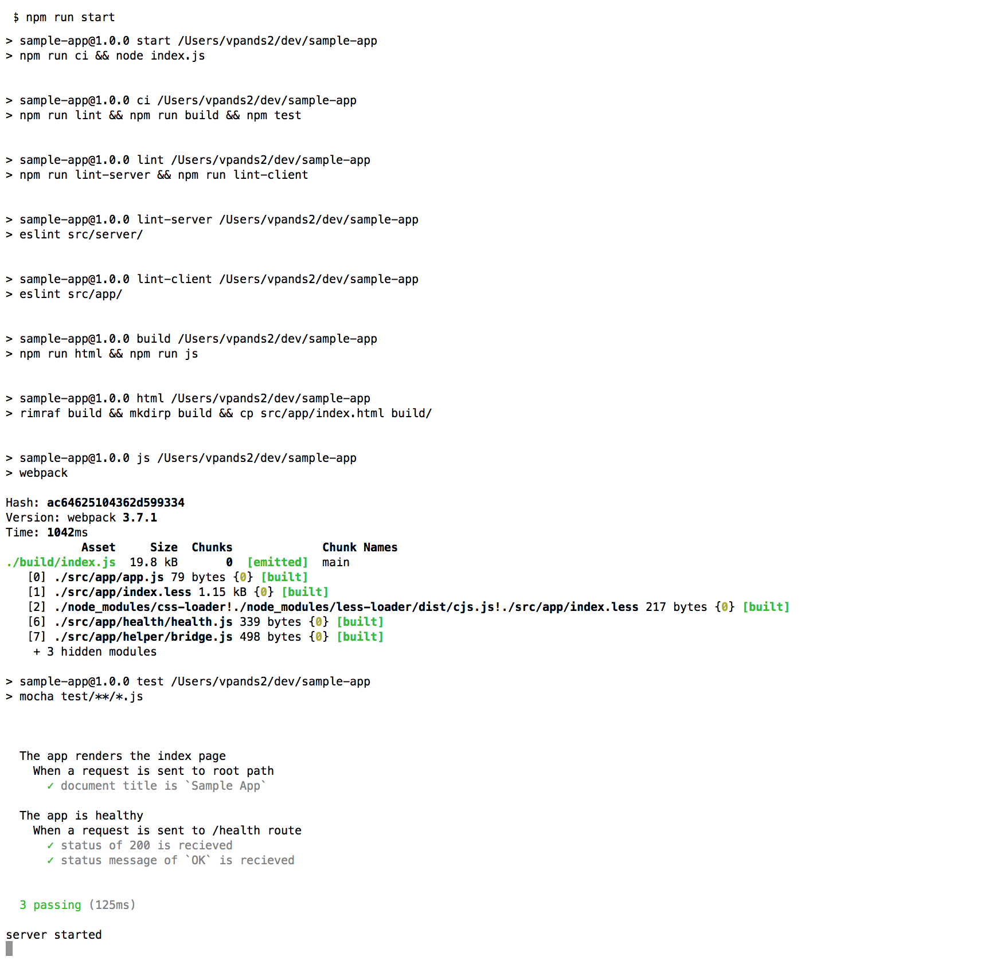

# Sample app

## Structure of the app

* Entrypoint of this node module is index.js
* the source files are contained in [src](./src) directory
  * Client files are contained in [src/client](./src/app) directory
  * Server side files is contained in the [src/server](./src/server) directory
* To create a new project use `npm init`

## Keeping it fresh

Code formatting is an essential requirement for easy maintainence of an application. This project uses [eslint](https://eslint.org/) for code linting
* eslint configs are stored in [.eslintrc.yml](./.eslintrc.yml)
* run `npm run lint` to see any lint errors. This will invoke linting on client and server side code

## Testing

* The server side logs of this application uses BDD flavour of testing using [chaijs](http://chaijs.com/) with [mocha](https://mochajs.org/) test framework.
* The client side uses `jsdom` to validate the UI
run `npm test` for tests

## CI

The project had added the npm script for CI for the app validation.
* After cloning the project in your CI server add below steps to enable CI validations

* `npm i`
* `npm run ci`

## Latest and greatest

This application show cases how you can write modularized code in your client side javascript.
* The usage of `webpack` let's us make use `require js` in the client side code and modularize the contents of an otherwise mamoth javascript file into manageable modules
* The usage of `babel-loader` in conjunction to webpack allows us to work with latest javascript version in the client side code
* The project uses `less` css preprocessor to modularize your css and enable on demand css inclusions
* I have not used any specific client framework to showcase this design can be achieved using any client side javascript framework

## Best practices

* Baseline the styling requirements of your project beforehand and create the style checklist configurations as a common artifact for different projects to use
* Think about using a code coverage tool (a common choice is [istanbul](https://github.com/gotwarlost/istanbul))
* Modularize the logic into different modules. A single node JS file should be solving a single objective
* Externalize your configurations (common choice is to use [nconf](https://github.com/indexzero/nconf), this has capability to pick configurations from various data sources)
* Avoid boilerplate code, there are several utility libraries that will do heavy lifting with efficient implementation. Common choices are [lodash](https://lodash.com/), [underscore](http://underscorejs.org/)
* Use randomized test data, consider using [chancejs](http://chancejs.com/) to setup a high range of test data for your unit tests

## Usage

Clone: `git clone https://github.com/shashwat5/sample-app.git`
Install dependencies: `npm i`
Start the application: `npm run start`

The npm script `npm run start` will invoke the following in order:
* lint: lints your server and client code
* build: copies static files to ./build folder and runs webpack for css and javascript
* test: runs test against your server and client side code
* `node index`: executes the entrypoint of this application to start the application

You should see the following logs on starting the application:

Goto `http://localhost:3001`, you should see the below web page:

